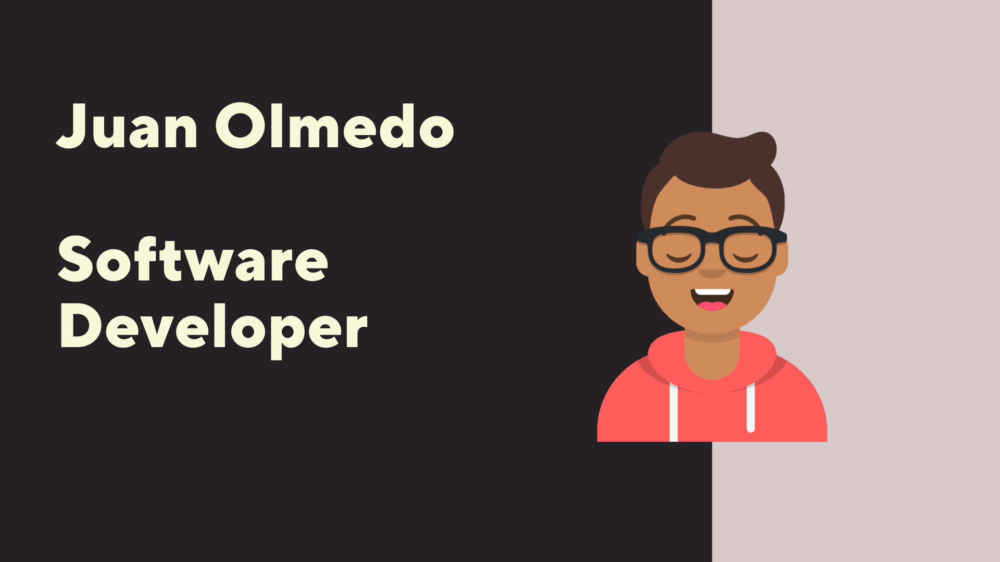

### Hi there 👋

I am a Java software developer with a strong background in Spring and Android development. My expertise extends to AWS cloud services, JavaScript, ReactJS, and database technologies including non-relational databases like MongoDB and relational databases like PostgreSQL. My passion lies in building applications that have a meaningful impact on users' lives by improving their quality of life.

In addition to my technical skills, I bring 14 years of experience as an Air Force veteran, where I honed my troubleshooting skills and breaking down complex problems into manageable tasks. This experience has equipped me with a unique perspective and problem-solving approach in the world of software development. I am also proficient in data structures and algorithms, enabling me to create efficient and effective solutions for a wide range of challenges.

<!--
**carlitos-1988/carlitos-1988** is a ✨ _special_ ✨ repository because its `README.md` (this file) appears on your GitHub profile.

Here are some ideas to get you started:

- 🔭 I’m currently working on ...
- 🌱 I’m currently learning ...
- 👯 I’m looking to collaborate on ...
- 🤔 I’m looking for help with ...
- 💬 Ask me about ...
- 📫 How to reach me: ...
- 😄 Pronouns: ...
- ⚡ Fun fact: ...
-->
